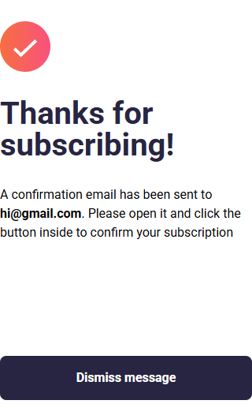
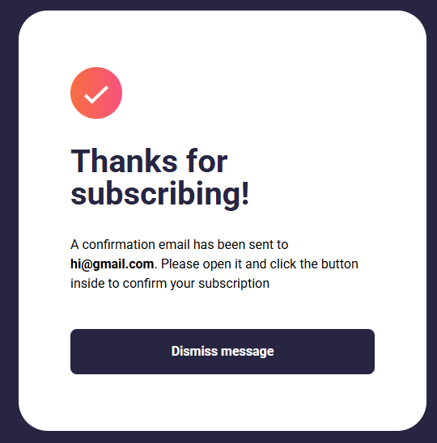
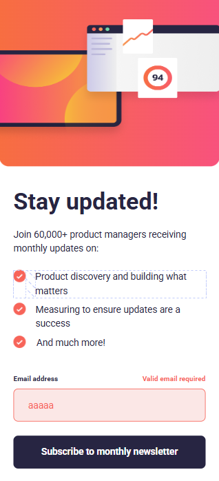

# Newsletter Sign-Up with Success Message

## Descripción
Reto de **Frontend Mentor** que consiste en construir un formulario de suscripción a un boletín y una pantalla de confirmación.  
Incluye validación de correo en el cliente, diseño **mobile-first** y transición suave entre páginas usando **sessionStorage** para compartir datos sin backend.

---

## Capturas de Pantalla

| Estado | Móvil | Escritorio |
|--------|-------|------------|
| **Formulario** |  |  |
| **Éxito** |  |  |
| **Error** |  |  |

---

## Tecnologías Utilizadas
- **HTML5** semántico
- **Sass (SCSS)** con metodología BEM  
  - Variables, mixins y breakpoints reutilizables
- **Vanilla JavaScript** para:
  - Validación de correo electrónico  
  - Redirección y persistencia con `sessionStorage`
- **Google Fonts – Roboto**
- **Frontend Mentor** (brief & assets)

---

## Retos y Aprendizajes

| Reto | ¿Qué aprendí / cómo lo resolví? |
|------|----------------------------------|
| Validar formularios de forma accesible | Uso de `aria-describedby`, mostrar mensaje y cambiar color/estilo **sin depender solo del color** para cumplir WCAG. |
| Persistir datos entre dos páginas estáticas | Aproveché **`sessionStorage`** para enviar el email a la pantalla de éxito sin backend. |
| Recortar y re-encuadrar imágenes responsivas | Combiné `object-fit`, `object-position` y transformaciones para que la ilustración se viera correcta en móvil, tablet y desktop. |
| SCSS modular | Separé estilos en `base/`, `components/` y `pages/`, usando `@forward` / `@use` para mantener limpio el namespace. |
| Mixin `flexbox()` | Creé un mixin genérico con `$direction` y `$gap` que reduce repetición y hace el CSS más legible. |
| Gradiente accesible en botones | Ajusté contraste y animé el gradiente solo en `:hover` para mantener la legibilidad del texto. |

---
